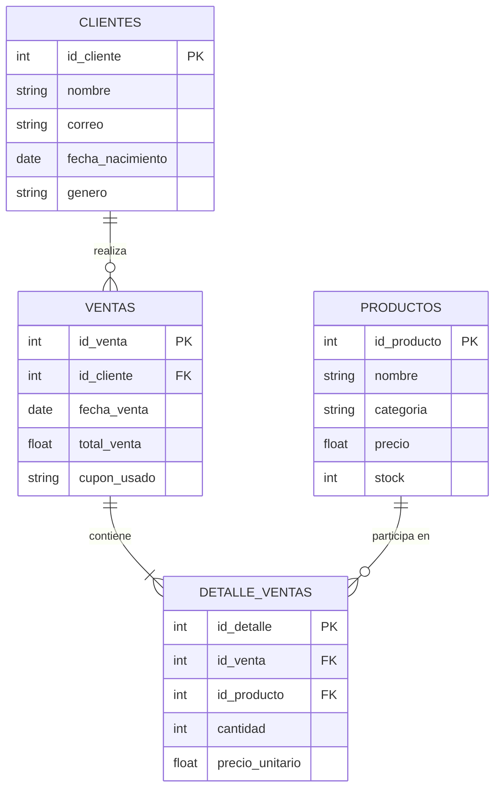

# 🪂 Taller SQL: "El Último Salto"

Bienvenida/o al taller educativo de SQL basado en una tienda de deportes extremos. Este repositorio contiene todo lo necesario para aprender SQL a través de consultas realistas de negocio.

## 📁 Estructura del Repositorio

```
Taller/
├── pyproject.toml            # Configuración del proyecto uv
├── uv.lock                   # Lock file con dependencias fijas
├── .venv/                    # Virtual environment (automático con uv)
├── generar_data.py           # Script para generar la BD
├── run.sh                    # Script bash para ejecutar fácilmente
├── tienda.db                 # Base de datos principal (generada)
├── README.md                 # Este archivo
├── taller.md                 # 30 ejercicios SQL
├── .gitignore                # Configuración de Git
└── datos/                    # Copia de tienda.db para estudiantes
    └── tienda.db
```

## ⚙️ Configuración del Proyecto con uv

El archivo `pyproject.toml` maneja:
- **Python:** 3.11.14 (fijo para consistencia)
- **Dependencias:** `faker>=40.4.0`
- **Lock file:** `uv.lock` asegura reproducibilidad

### Comandos uv Útiles

```bash
# Synchronizar dependencias e instalar venv
uv sync

# Ejecutar script Python
uv run python generar_data.py

# Ejecutar comando en el venv
uv run python -c "print('Hola desde uv')"

# Acceder al venv directamente
source .venv/bin/activate
python --version  # Verás 3.11.14
deactivate
```

## 🚀 Inicio Rápido

### Requisitos Previos

- **uv**: Gestor de proyectos Python ultrarrápido
  ```bash
  # Instalar uv (si no lo tienes)
  curl -LsSf https://astral.sh/uv/install.sh | sh
  ```
- **Python 3.11**: Manejado automáticamente por uv

### 1. Generar la Base de Datos

**Opción A: Con uv (recomendado)**

```bash
# Primera vez: instala dependencias
uv sync

# Ejecuta el generador
uv run python generar_data.py
```

**Opción B: Con script bash**

```bash
bash run.sh
```

**Opción C: Con Python directo (si ya tienes faker)**

```bash
python3 generar_data.py
```

**Requisitos (automáticos con uv):**
- Python 3.11+
- Librería `faker>=40.4.0`
- `sqlite3` (incluido en Python)

**Salida esperada:**
- Archivo `tienda.db` (SQLite)
- ~250 clientes
- ~1,250 ventas
- 15 productos
- Datos realistas con cupones intelligentes

### 2. Verificar la Base de Datos

**Con uv:**

```bash
uv run python -c "
import sqlite3
conn = sqlite3.connect('tienda.db')
cursor = conn.cursor()
cursor.execute('SELECT COUNT(*) as total_ventas FROM ventas')
print('Total ventas:', cursor.fetchone()[0])
cursor.execute('SELECT COUNT(*) as cupones FROM ventas WHERE cupon_usado = \"ULTIMO_SUSPIRO\"')
print('Cupones aplicados:', cursor.fetchone()[0])
"
```

**Con sqlite3 directo:**


Prueba esto en la consola SQL:
```sql
SELECT COUNT(*) as total_ventas FROM ventas;
SELECT COUNT(*) as cupones FROM ventas WHERE cupon_usado = 'ULTIMO_SUSPIRO';
```

### 3. Resolver los Ejercicios

Lee [taller.md](taller.md) para los 30 ejercicios propostos y sigue las instrucciones de entrega.

## 📚 Contenido del Taller

| Sección | Cantidad | Dificultad | Temas |
|---------|----------|-----------|-------|
| Nivel 1-2 | 15 ejercicios | 🟢 Fácil | SELECT, WHERE, ORDER BY, COUNT, SUM, AVG, MIN, MAX |
| Nivel 3-4 | 15 ejercicios | 🟡 Intermedio | JOINS, GROUP BY, HAVING, CTEs, Subconsultas, CASE |

## 📊 Contexto del Negocio

**Tienda:** "El Último Salto" - Especialista en paracaidismo y deportes extremos.

**Productos Principales:**
- Paracaídas (Militar, Deportivo, Emergencia)
- Accesorios (Cascos, Altímetros, Trajes de vuelo, Gafas)

**Lógica Especial:**
- Cupón **"ULTIMO_SUSPIRO"**: 30% descuento exclusivo para clientes > 60 años
- Datos de ~2 años (2024-2025)
- Base sintética pero realista

## 🗄️ Diagrama Entidad-Relación



### 📐 Explicación de las Relaciones

| Relación | Multiplicidad | Significado |
|----------|---------------|-------------|
| **CLIENTES → VENTAS** | 1:N | Un cliente puede hacer múltiples ventas |
| **VENTAS → DETALLE_VENTAS** | 1:N | Una venta contiene uno o más productos |
| **PRODUCTOS → DETALLE_VENTAS** | 1:N | Un producto puede aparecer en múltiples ventas |

### 🔑 Claves Primarias y Foráneas

- **Claves Primarias (PK):** `id_cliente`, `id_producto`, `id_venta`, `id_detalle`
- **Claves Foráneas (FK):** 
  - `ventas.id_cliente` → `clientes.id_cliente`
  - `detalle_ventas.id_venta` → `ventas.id_venta`
  - `detalle_ventas.id_producto` → `productos.id_producto`

## 📋 Cómo Entregar el Taller (Para Estudiantes)

1. **Crear repositorio** con estructura recomendada en `taller.md`
2. **Archivo por ejercicio:** `01_ejercicio.sql`, `02_ejercicio.sql`, etc.
3. **Hacer commits** lógicos en Git
4. **Incluir un README.md** en tu solución explicando cómo ejecutar
5. **Entregar URL** del repositorio

## 🛠️ Herramientas Recomendadas

- **CLI:** `sqlite3` (incluido en macOS/Linux)
- **IDE SQL:**
  - [DBeaver Community](https://dbeaver.io/) (Gratis)
  - [DataGrip](https://www.jetbrains.com/datagrip/) (Pago, pero muy bueno)
  - [VS Code + SQLTools Extension](https://marketplace.visualstudio.com/items?itemName=mtxr.sqltools)
- **Python:** `sqlite3` module + cualquier editor

## 📖 Recursos para Aprender SQL

- [SQLite Official Docs](https://www.sqlite.org/lang.html)
- [W3Schools SQL Tutorial](https://www.w3schools.com/sql/) (Sencillo y práctico)
- [Mode Analytics SQL Tutorial](https://mode.com/sql-tutorial/) (Muy visual)
- [SQL Joins Visualizer](https://sql-joins.leopard.in.ua/)

## ❓ Preguntas Frecuentes

**P: ¿Necesito base de datos remota?**  
R: No. SQLite es local, suficiente para el taller.

**P: ¿Cuánto tiempo toma resolver todo?**  
R: ~4-8 horas para resolver los 30 ejercicios bien, dependiendo de experiencia.

**P: ¿Puedo modificar tienda.db?**  
R: En principio no (es solo lectura). Si deseas experimentar, haz una copia primero.

**P: ¿Hay soluciones disponibles?**  
R: Las soluciones serán mostradas en un futuro.
## 👨‍🏫 Para Instructores

Este material está diseñado para:
- ✅ Estudiantes principiantes en SQL
- ✅ Estudiantes de carrera de datos o ingeniería
- ✅ Ser usado en aula o como autoestudio

**Recomendación:** Aumenta el nivel gradualmente. 
- Semana 1: Ejercicios 1-15
- Semana 2: Ejercicios 16-30

---

**Generado:** Febrero 2026  
**Versión:** 1.0  
**Licencia:** Educational Use  

¡Que disfrutes el taller! 🚀
